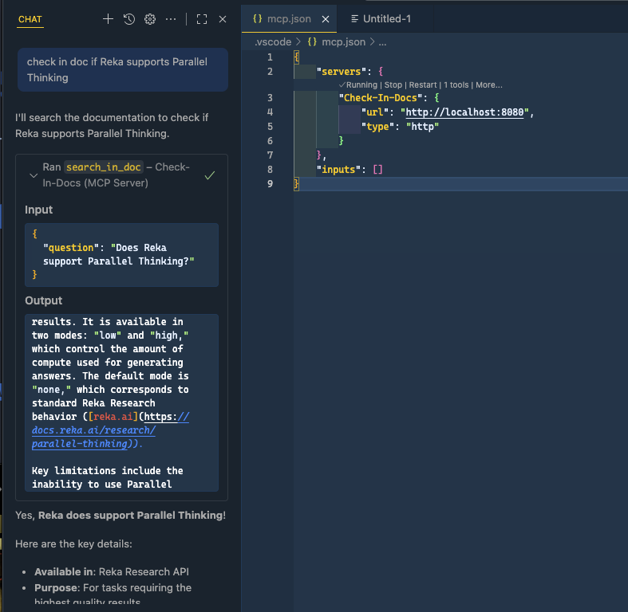

     [](https://github.com/fboucher/check-in-doc-mcp/actions/workflows/docker-publish.yml)  [![Reka AI](https://img.shields.io/badge/Power%20By-2E2F2F?style=flat&logo=data%3Aimage%2Fsvg%2Bxml%3Bbase64%2CPD94bWwgdmVyc2lvbj0iMS4wIiBlbmNvZGluZz0iVVRGLTgiPz4KPHN2ZyBpZD0iTGF5ZXJfMSIgZGF0YS1uYW1lPSJMYXllciAxIiB4bWxucz0iaHR0cDovL3d3dy53My5vcmcvMjAwMC9zdmciIHZpZXdCb3g9IjAgMCA2NjYuOTQgNjgxLjI2Ij4KICA8ZGVmcz4KICAgIDxzdHlsZT4KICAgICAgLmNscy0xIHsKICAgICAgICBmaWxsOiBub25lOwogICAgICB9CgogICAgICAuY2xzLTIgewogICAgICAgIGZpbGw6ICNmMWVlZTc7CiAgICAgIH0KICAgIDwvc3R5bGU%2BCiAgPC9kZWZzPgogIDxyZWN0IGNsYXNzPSJjbHMtMSIgeD0iLS4yOSIgeT0iLS4xOSIgd2lkdGg9IjY2Ny4yMiIgaGVpZ2h0PSI2ODEuMzMiLz4KICA8Zz4KICAgIDxwYXRoIGNsYXNzPSJjbHMtMiIgZD0iTTMxOC4zNCwwTDgyLjY3LjE2QzM2Ljg1LjE5LS4yOSwzNy4zOC0uMjksODMuMjd2MjM1LjEyaDc0LjkzVjcxLjc1aDI0My43M1YwaC0uMDNaIi8%2BCiAgICA8cGF0aCBjbGFzcz0iY2xzLTIiIGQ9Ik03Mi45NywzNjIuOTdIMHYzMTguMTZoNzIuOTd2LTMxOC4xNloiLz4KICAgIDxwYXRoIGNsYXNzPSJjbHMtMiIgZD0iTTMxNS4zMywzNjIuODRoLTk5LjEzbC0xMDkuNSwxMDcuMjljLTEzLjk1LDEzLjY4LTIxLjgyLDMyLjM3LTIxLjgyLDUxLjkyczcuODYsMzguMjQsMjEuODIsNTEuOTJsMTA5LjUsMTA3LjI5aDEwMS42M2wtMTYyLjQ1LTE2MS43MiwxNTkuOTUtMTU2LjY3di0uMDNaIi8%2BCiAgICA8cGF0aCBjbGFzcz0iY2xzLTIiIGQ9Ik0zNDguNTksODIuOTJ2MTUyLjIzYzAsNDUuOTIsMzcuMTYsODMuMTEsODMuMDUsODMuMTFoMjMwLjI4di03MS43OGgtMjQwLjMzVjg1Ljg3YzAtNy43NCw2LjI4LTE0LjA2LDE0LjA1LTE0LjA2aDE0NC4zMmM3Ljc0LDAsMTQuMDUsNi4yOCwxNC4wNSwxNC4wNiwwLDUuOS0zLjcxLDExLjE3LTkuMjMsMTMuMmwtMTQ3LjQ1LDU2LjIzdjcwLjczbDE3NC41Ny02Mi4yYzMzLjA0LTExLjgsNTUuMTEtNDMuMTMsNTUuMTEtNzguMjZ2LTIuNjdDNjY3LDM3LDYyOS44LS4xOSw1ODMuOTUtLjE5aC0xNTIuMjdjLTQ1Ljg5LDAtODMuMDUsMzcuMTktODMuMDUsODMuMTFoLS4wM1oiLz4KICAgIDxwYXRoIGNsYXNzPSJjbHMtMiIgZD0iTTY2Ni45NCw1OTguMTJ2LTE1Mi4yM2MwLTQ1Ljg5LTM3LjE2LTgzLjExLTgzLjA1LTgzLjExaC0yMzAuMjh2NzEuNzhoMjQwLjMzdjE2MC42MWMwLDcuNzQtNi4yOCwxNC4wNi0xNC4wNSwxNC4wNmgtMTQ0LjMxYy03Ljc0LDAtMTQuMDUtNi4yOC0xNC4wNS0xNC4wNiwwLTUuOSwzLjcxLTExLjE3LDkuMjMtMTMuMmwxNDcuNDUtNTYuMjN2LTcwLjczbC0xNzQuNTcsNjIuMmMtMzMuMDQsMTEuOC01NS4xMSw0My4xMy01NS4xMSw3OC4yNnYyLjY3YzAsNDUuOTIsMzcuMTYsODMuMTEsODMuMDUsODMuMTFoMTUyLjI3YzQ1Ljg5LDAsODMuMDUtMzcuMTksODMuMDUtODMuMTFoLjAzWiIvPgogIDwvZz4KPC9zdmc%2B&logoSize=auto&labelColor=2E2F2F&color=F1EEE7)](https://reka.ai/)

# Check-In Doc MCP: Documentation Search MCP Server

This project is a Model Context Protocol (MCP) Server that enables powerful, customizable search across online documentation websites about a given topic. You control which domains are searchable by setting the `ALLOWED_DOMAINS` variable (comma-separated) in the `.env` file.

**For developers:** Easily search only trusted documentation sources by specifying your preferred domains.

**For businesses:** Host your own dedicated MCP server to provide users with a secure, branded search experience across your official documentation. Deploying this server ensures your users always get trusted, up-to-date answers from your chosen sources.



## Key Features

- **Customizable Search Domains:** Control which documentation sites are searched by editing the `ALLOWED_DOMAINS` variable in your `.env` file.
- **Flexible Deployment:** Host locally for personal use, or deploy remotely to provide a business-wide documentation search MCP server.
- **Secure by Design:** The container runs as a non-root user and environment variables are managed securely.

---

## Environment Variables

- The service uses environment variables defined in `src/.env`. You can use the provided `src/.env-sample` as a template.
- **ALLOWED_DOMAINS:** Comma-separated list of domains that the server is allowed to search. Example: `ALLOWED_DOMAINS=docs.reka.ai,docs.github.com`
- **APIKEY:** API key for accessing the Reka Platform. This is the environment variable name to use in your `.env` file. See below for how to obtain and set this key.

### Setting Up Your Reka API Key

1. Go to the [Reka Platform dashboard](https://link.reka.ai/free).
2. Open the **API Keys** section on the left.
3. Create a new key and copy it to your environment.
4. Rename the file `.env-sample` to `.env` in the `src` directory.
5. Replace the placeholder (`HERE_GOES_YOUR_API_KEY`) in `.env` with the key you just created, using the `APIKEY` entry.

Voilà! You are all set!

## Running the MCP Server

1. Ensure your environment variables are set in `src/.env` (copy from `src/.env-sample`).
2. You can run the project in several ways:

### Run with Docker or Podman

```sh
# Docker
docker compose up --build

# Podman (macOS/Linux alternative)
podman compose up --build
```

This will build the image from `src/Dockerfile` and start the service.

### Run Locally with .NET

From the `src` directory, you can run the project directly for local testing:

```sh
cd src
dotnet run
```

This will start the MCP server locally on port 8080.

### Publish and Run Standalone

To create a standalone deployment, use `dotnet publish`:

```sh
cd src
dotnet publish -c Release -r linux-x64 --self-contained true -o ./publish
```

- `-c Release`: Builds in Release mode for optimized performance.
- `-r linux-x64`: Publishes for Linux x64 (change to `osx-x64`, `win-x64`, etc. as needed).
- `--self-contained true`: Includes the .NET runtime so the target machine does not need .NET installed.
- `-o ./publish`: Outputs the published files to the `publish` folder.

To run the published output:

```sh
cd src/publish
./CheckInDocMCP
```

The server will start and listen on port 8080.

## Adding the MCP Server to VS Code

Once the MCP server is up and running, to add it in VS Code, select **Add a MCP server** and use the following configuration:

```json
{
  "servers": {
    "Check-In-Docs": {
      "url": "http://localhost:8080",
      "type": "http"
    }
  },
  "inputs": []
}
```

Refer to the Dockerfile and Compose file for further customization as needed.

## References

- [Docs: Reka Research API](https://docs.reka.ai/research)
- [Discord](https://link.reka.ai/discord)

## 🤝 Contributions

If you find a bug or would like to add a feature, please read our [Code of Conduct](CODE_OF_CONDUCT.md) and the [Contributing Guide](CONTRIBUTING.md).

Feel free to open an issue or submit a PR—feedback and improvements are welcome.
