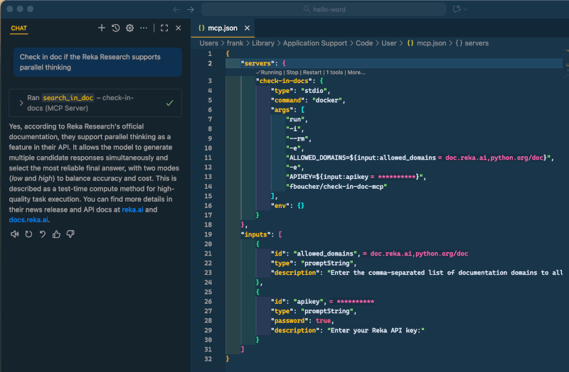

     [](https://github.com/fboucher/check-in-doc-mcp/actions/workflows/docker-publish.yml)  [![Reka AI](https://img.shields.io/badge/Power%20By-2E2F2F?style=flat&logo=data%3Aimage%2Fsvg%2Bxml%3Bbase64%2CPD94bWwgdmVyc2lvbj0iMS4wIiBlbmNvZGluZz0iVVRGLTgiPz4KPHN2ZyBpZD0iTGF5ZXJfMSIgZGF0YS1uYW1lPSJMYXllciAxIiB4bWxucz0iaHR0cDovL3d3dy53My5vcmcvMjAwMC9zdmciIHZpZXdCb3g9IjAgMCA2NjYuOTQgNjgxLjI2Ij4KICA8ZGVmcz4KICAgIDxzdHlsZT4KICAgICAgLmNscy0xIHsKICAgICAgICBmaWxsOiBub25lOwogICAgICB9CgogICAgICAuY2xzLTIgewogICAgICAgIGZpbGw6ICNmMWVlZTc7CiAgICAgIH0KICAgIDwvc3R5bGU%2BCiAgPC9kZWZzPgogIDxyZWN0IGNsYXNzPSJjbHMtMSIgeD0iLS4yOSIgeT0iLS4xOSIgd2lkdGg9IjY2Ny4yMiIgaGVpZ2h0PSI2ODEuMzMiLz4KICA8Zz4KICAgIDxwYXRoIGNsYXNzPSJjbHMtMiIgZD0iTTMxOC4zNCwwTDgyLjY3LjE2QzM2Ljg1LjE5LS4yOSwzNy4zOC0uMjksODMuMjd2MjM1LjEyaDc0LjkzVjcxLjc1aDI0My43M1YwaC0uMDNaIi8%2BCiAgICA8cGF0aCBjbGFzcz0iY2xzLTIiIGQ9Ik03Mi45NywzNjIuOTdIMHYzMTguMTZoNzIuOTd2LTMxOC4xNloiLz4KICAgIDxwYXRoIGNsYXNzPSJjbHMtMiIgZD0iTTMxNS4zMywzNjIuODRoLTk5LjEzbC0xMDkuNSwxMDcuMjljLTEzLjk1LDEzLjY4LTIxLjgyLDMyLjM3LTIxLjgyLDUxLjkyczcuODYsMzguMjQsMjEuODIsNTEuOTJsMTA5LjUsMTA3LjI5aDEwMS42M2wtMTYyLjQ1LTE2MS43MiwxNTkuOTUtMTU2LjY3di0uMDNaIi8%2BCiAgICA8cGF0aCBjbGFzcz0iY2xzLTIiIGQ9Ik0zNDguNTksODIuOTJ2MTUyLjIzYzAsNDUuOTIsMzcuMTYsODMuMTEsODMuMDUsODMuMTFoMjMwLjI4di03MS43OGgtMjQwLjMzVjg1Ljg3YzAtNy43NCw2LjI4LTE0LjA2LDE0LjA1LTE0LjA2aDE0NC4zMmM3Ljc0LDAsMTQuMDUsNi4yOCwxNC4wNSwxNC4wNiwwLDUuOS0zLjcxLDExLjE3LTkuMjMsMTMuMmwtMTQ3LjQ1LDU2LjIzdjcwLjczbDE3NC41Ny02Mi4yYzMzLjA0LTExLjgsNTUuMTEtNDMuMTMsNTUuMTEtNzguMjZ2LTIuNjdDNjY3LDM3LDYyOS44LS4xOSw1ODMuOTUtLjE5aC0xNTIuMjdjLTQ1Ljg5LDAtODMuMDUsMzcuMTktODMuMDUsODMuMTFoLS4wM1oiLz4KICAgIDxwYXRoIGNsYXNzPSJjbHMtMiIgZD0iTTY2Ni45NCw1OTguMTJ2LTE1Mi4yM2MwLTQ1Ljg5LTM3LjE2LTgzLjExLTgzLjA1LTgzLjExaC0yMzAuMjh2NzEuNzhoMjQwLjMzdjE2MC42MWMwLDcuNzQtNi4yOCwxNC4wNi0xNC4wNSwxNC4wNmgtMTQ0LjMxYy03Ljc0LDAtMTQuMDUtNi4yOC0xNC4wNS0xNC4wNiwwLTUuOSwzLjcxLTExLjE3LDkuMjMtMTMuMmwxNDcuNDUtNTYuMjN2LTcwLjczbC0xNzQuNTcsNjIuMmMtMzMuMDQsMTEuOC01NS4xMSw0My4xMy01NS4xMSw3OC4yNnYyLjY3YzAsNDUuOTIsMzcuMTYsODMuMTEsODMuMDUsODMuMTFoMTUyLjI3YzQ1Ljg5LDAsODMuMDUtMzcuMTksODMuMDUtODMuMTFoLjAzWiIvPgogIDwvZz4KPC9zdmc%2B&logoSize=auto&labelColor=2E2F2F&color=F1EEE7)](https://reka.ai/)  [](https://hub.docker.com/repository/docker/fboucher/check-in-doc-mcp)

[](https://vscode.dev/redirect/mcp/install?name=check-in-doc-mcp&config=%7B%22command%22%3A%22docker%22%2C%22args%22%3A%5B%22run%22%2C%22-i%22%2C%22--rm%22%2C%22fboucher%2Fcheck-In-Docs%22%2C%22-e%22%2C%22APIKEY%3D%24APIKEY%22%2C%22-e%22%2C%22ALLOWED_DOMAINS%3D%24ALLOWED_DOMAINS%22%5D%2C%22env%22%3A%7B%22APIKEY%22%3A%22%3Cyour-api-key-here%3E%22%2C%22ALLOWED_DOMAINS%22%3A%22domian-a.com%2Cdomain-b.com%22%7D%7D)

# Check-In Doc MCP: Documentation Search MCP Server

This project is a Model Context Protocol (MCP) Server that enables powerful, customizable search across online documentation websites about a given topic. You control which domains are searchable by setting the `ALLOWED_DOMAINS` variable (comma-separated).

**For developers:** Easily search only trusted documentation sources by specifying your preferred domains.

**For businesses:** Host your own dedicated MCP server to provide users with a secure, branded search experience across your official documentation. Deploying this server ensures your users always get trusted, up-to-date answers from your chosen sources.



## Key Features

- **Customizable Search Domains:** Control which documentation sites are searched by editing the `ALLOWED_DOMAINS` variable.
- **Flexible Deployment:** Host locally for personal use, or deploy remotely to provide a business-wide documentation search MCP server.
- **Secure by Design:** The container runs as a non-root user and environment variables are managed securely.

---

## Prerequisites

To use this MCP server you will require an API Key. Good news, by creating a free account on the Reka Platform, you can get one at no cost!

1. Go to the [Reka Platform dashboard](https://link.reka.ai/free).
2. Open the **API Keys** section on the left.
3. Create a new key and note it, will be used later.

## VS Code with MCP Extension

You can add a new MCP server by using the buttons *Add MCP Server* in VS Code. When prompt for the type of server, select **Docker image**, the image name is `fboucher/check-in-doc-mcp`. Then add your list of domains and API key.

**OR**(suggested)

Alternatively, you can add the following configuration to your MCP servers configuration (`mcp.json`) in VS Code. We suggest using this method as it will prevent your API key from being stored in plain text.

```json
{
 "servers": {
  "check-in-docs": {
   "type": "stdio",
   "command": "docker",
   "args": [
    "run",
    "-i",
    "--rm",
    "-e",
    "ALLOWED_DOMAINS=${input:allowed_domains}",
    "-e",
    "APIKEY=${input:apikey}",
    "fboucher/check-in-doc-mcp"
   ],
   "env": {}
  }
 },
 "inputs": [
  {
   "id": "allowed_domains",
   "type": "promptString",
   "description": "Enter the comma-separated list of documentation domains to allow for search (e.g. docs.reka.ai,docs.github.com):"
  },
  {
   "id": "apikey",
   "type": "promptString",
   "password": true,
   "description": "Enter your Reka Platform API key:"
  }
 ]
}
```

## 🛠️ Available Tools

### `SearchInDoc`

This tool allows searching for documentation on specified domains.

**Example usage:**

```text
Check in doc if the Reka Research supports parallel thinking
```


## References

- [Docs: Reka Research API](https://docs.reka.ai/research)
- [Discord](https://link.reka.ai/discord)

## 🤝 Contributions

If you find a bug or would like to add a feature, please read our [Code of Conduct](CODE_OF_CONDUCT.md) and the [Contributing Guide](CONTRIBUTING.md).

Feel free to open an issue or submit a PR—feedback and improvements are welcome.
